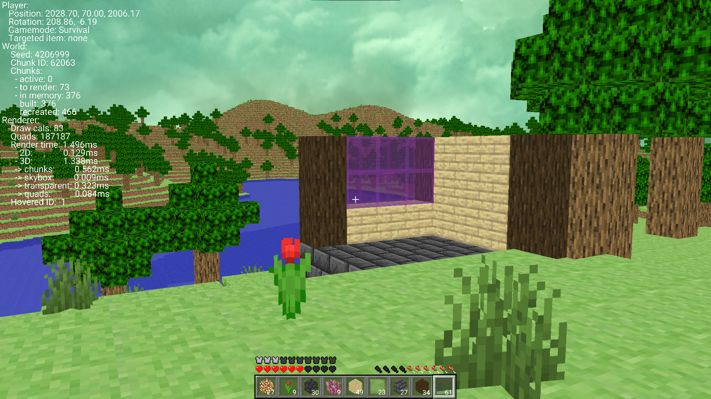

# KuchCraft

KuchCraft is the **first version of a Minecraft clone** developed in C++. Unlike its successor, KuchCraft 2, this version does **not** utilize an **Entity Component System (ECS)** and features a more basic implementation of core game mechanics.

## Features

### Core Gameplay
- **Basic Physics** – Simple movement and collision handling.
- **Block Placement & Removal** – Players can place and remove blocks in the world.
- **Game Modes** – Supports **Creative** and **Spectator** modes.

### Rendering
- **Frustum Culling** – Prevents rendering of unseen objects to optimize performance.
- **Batch Renderer** – Efficiently processes and renders large amounts of geometry.
- **Real-time Transparent Object Sorting** – Ensures correct rendering order for transparent blocks.

### World Generation
- **Simple Procedural World** – Generates forests, lakes, and mountains.

### User Interface
- **Custom UI System** – Basic interface for interacting with the game.

## Differences from KuchCraft 2
- **No ECS** – Uses a simpler game object structure.
- **Less Optimization** – More straightforward rendering and game logic.
- **Fewer Features** – A foundation for later improvements in KuchCraft 2.

## Build
Clone the repository with `git clone --recursive https://github.com/wooodiest/KuchCraft`

Project tested in Visual Studio 2022, currently works only for Windows. To generate the project run `Win-GenProjects.bat` found in `scripts` folder.

## Future Plans (Discontinued in Favor of KuchCraft 2)
KuchCraft 1 served as a **learning project** and a **foundation** for KuchCraft 2, which introduces a more advanced architecture, better optimization, and expanded gameplay mechanics.
